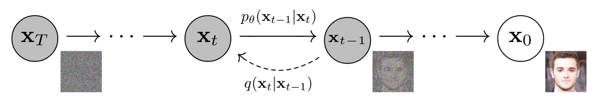
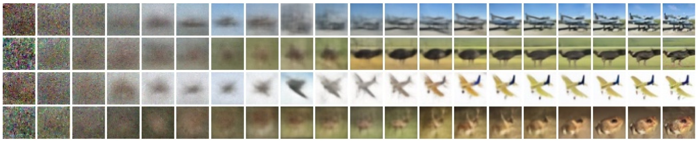
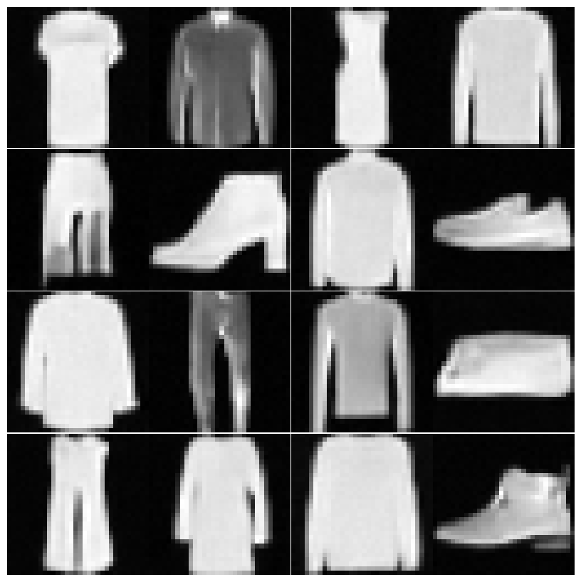

# Denoising Diffusion Probabilistic Models

## Methodology

DDPM [[1]](#ref1) presents a diffusion model that samples images from Gaussian noise. We gradually add noise to the images according to a determined variance schedule and train the network to predict the added noise. To sample images, we start with a Gaussian distribution and progressively remove the noise predicted by the network.

In the original paper, the variance schedule $(\beta_t)_{t\in[0,T]}$ is increasing linearly, and determines how much noise is added in the forward process :

$$
q\left(\mathbf{x}_t \mid \mathbf{x}_0\right) = \mathcal{N}\left(\mathbf{x}_t; \sqrt{\overline{\alpha}_t} \mathbf{x}_0, (1 - \overline{\alpha}_t) \mathbf{I}\right)
$$

where $\alpha_t = 1 - \beta_t$ and $\overline{\alpha}_t = \prod_{s=1}^{t}\alpha_s$. This closed form formula for sampling $\mathbf{x}_t$ at any timestep $t$ is useful in practice :

$$
\mathbf{x}_t = \sqrt{\overline{\alpha}_t}\mathbf{x}_0 + \sqrt{1-\overline{\alpha}_t}\boldsymbol{\epsilon}, \quad \boldsymbol{\epsilon} \sim \mathcal{N}(\mathbf{0},\mathbf{I})
$$

The model learns to predict $\boldsymbol{\epsilon}$ using a simple variant of the variational lower bound loss :

$$
L(\theta) := \mathbb{E}_{t, \mathbf{x}_0, \boldsymbol{\epsilon}} \left[ \left\lVert \boldsymbol{\epsilon} - \boldsymbol{\epsilon}_\theta \left( \sqrt{\bar{\alpha}_t} \mathbf{x}_0 + \sqrt{1 - \bar{\alpha}_t} \boldsymbol{\epsilon}, t \right) \right\rVert^2 \right]
$$

Sampling is done by removing noise gradually from $t=T$ down to $t=1$ according to the following equation :

$$
\mathbf{x}_{t-1} = \frac{1}{\sqrt{\alpha_t}} \left( \mathbf{x}_t - \frac{1 - \alpha_t}{\sqrt{1 - \overline{\alpha}_t}} \boldsymbol{\epsilon}_\theta(\mathbf{x}_t, t) \right) + \sqrt{\beta_t} \mathbf{z}
$$

where $\mathbf{z} \sim \mathcal{N}(\mathbf{0}, \mathbf{I})$ for $t > 1$, and $\mathbf{z} = \mathbf{0}$ for $t=1$.

## Architecture

The model itself is a U-Net with residual convolutions and attention layers between some convolutions. The current time $t$, which defines the noising level, is added in the network through positional embeddings.

## Cosine and Linear schedule comparison

While the linear schedule works, it destroys information too aggressively in the early stages of the forward process. To stabilize the training, we aim for a noise schedule that is progressive and as linear as possible. We therefore tested an alternative scheme based on the recommendations from the paper *Improved Denoising Diffusion Probabilistic Models* [[2]](#ref2). In this approach, we use the cosine function to define $\overline{\alpha}_t$ as follows:

$$
\overline{\alpha}_t = \frac{f(t)}{f(0)}, \quad f(t)=\cos\left(\frac{t/T+s}{1+s}\times\frac{\pi}{2}\right)^2
$$

where $s>0$ is an offset used to ensure that $\beta_t$ does not become too small near $t=0$.

## Implementation

- `model.py` contains the model and all the building blocks used in PyTorch. 
- `schedule.py` implements the cosine and linear schedule.
- `diffusion.py` implements the noising process $q$ according to the chosen schedule.
- `utils.py` provides a custom image dataset class and a visualization function for images.

## Results

Below are my own results, training on Kaggle with an NVIDIA T4:

### Fashion MNIST

## References

<a id="ref1">[1]</a> Jonathan Ho, Ajay Jain, Pieter Abbeel. (2020). [Denoising Diffusion Probabilistic Models](https://arxiv.org/abs/2006.11239). arXiv:2006.11239.

<a id="ref2">[2]</a> Alex Nichol, Prafulla Dhariwal. (2021). [Improved Denoising Diffusion Probabilistic Models](https://arxiv.org/abs/2102.09672). arXiv:2102.09672.